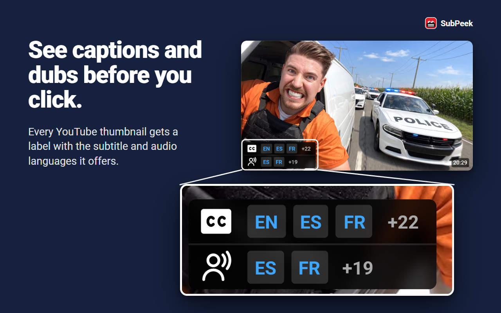

# SubPeek - Caption & Dub Labels for YouTube

A Chrome/Firefox browser extension that shows which YouTube videos have captions (subtitles) and dubbed audio tracks in your languages, right on the thumbnail - before you click.

**[Install from the Chrome Web Store](https://chromewebstore.google.com/detail/cnkfniefdmiiphamafjjeengnjpkfeea?utm_source=github-readme)** - Firefox Add-ons: coming soon



## Features

- **Badges on thumbnails**: caption and audio-track availability appears as small overlays on every video thumbnail (home, search, subscriptions, sidebar)
- **Favorite languages**: pick the languages you care about; matching tracks are highlighted and sorted first
- **Track popup**: click a badge to see the full list of caption/audio languages for that video and toggle favorites inline
- **Fast and polite**: results are cached locally for 30 minutes, lookups only run for thumbnails that actually scroll into view, and concurrent requests are capped with rate-limit backoff
- **One-click off switch**: flip the toggle in the toolbar popup (or the power button in the track popup) and SubPeek removes its badges and stops all lookups until you turn it back on

## Privacy

SubPeek collects no data.

- Your favorite-language list is stored locally in the browser (`browser.storage.local`)
- Video track data is fetched directly from YouTube itself, using the same endpoints the site uses, and cached locally in IndexedDB
- No analytics, no telemetry, no third-party servers, no remote code - the extension package is fully self-contained (fonts included)
- The "Send feedback" link in the popup opens a Google Form in a new tab; the extension version and browser major (e.g. `1.0.0 Chrome 152`) are pre-filled in the link so you don't have to type them. The extension itself sends nothing, and no response is recorded unless you press Submit

Permissions: `storage` plus host access to `youtube.com` only.

## Feedback

Found a bug or have an idea? Use the [feedback form](https://docs.google.com/forms/d/e/1FAIpQLSfsnyyLlHckyDhdk30rz5ZZh_T6qP1OKWPVNthX8xcTZbiOEw/viewform?hl=en) (no sign-in needed) or [open an issue](https://github.com/mpadlein/SubPeek/issues). For bugs, the page you were on (home, search, watch page) and any `[SubPeek]` lines from the browser console help a lot.

## Install

- Chrome Web Store: [SubPeek - Caption & Dub Labels for YouTube](https://chromewebstore.google.com/detail/cnkfniefdmiiphamafjjeengnjpkfeea?utm_source=github-readme) (also works in Edge and other Chromium browsers)
- Firefox Add-ons (AMO): coming soon

## Development

### Prerequisites

- [Node.js](https://nodejs.org/) 22 or later (built and tested with Node v24.12.0, npm 11.6.2)
- npm (bundled with Node)

### Setup

```sh
npm install
```

`npm install` runs `wxt prepare` automatically (postinstall), which generates TypeScript types in `.wxt/`. If types are missing or stale, run `npx wxt prepare` manually.

### Commands

| Command                 | Purpose                                  |
| ----------------------- | ---------------------------------------- |
| `npm run dev`           | Dev mode with hot reload (Chrome)        |
| `npm run dev:firefox`   | Dev mode (Firefox)                       |
| `npm run build`         | Production build (Chrome, MV3)           |
| `npm run build:firefox` | Production build (Firefox)               |
| `npm run compile`       | Type-check with `tsc --noEmit`           |
| `npm run zip`           | Package Chrome build for distribution    |
| `npm run zip:firefox`   | Package Firefox build (+ source archive) |

There is no test framework configured.

## Building from source

See [BUILDING.md](BUILDING.md) for reproducible build instructions (exact environment, commands, and output locations). `npm run zip:firefox` also generates `.output/subpeek-<version>-sources.zip`, the source archive for AMO review.

The bundled Inter font files in `public/fonts/` are the latin and latin-ext woff2 subsets of [Inter](https://github.com/rsms/inter), licensed under the SIL Open Font License 1.1 (`public/fonts/OFL.txt`).

## How it works

1. A content script watches the page for video thumbnails (`MutationObserver`) and defers work until a thumbnail is actually visible (`IntersectionObserver`)
2. For each visible video, track data is fetched from YouTube's InnerTube API (the page's own config is read from its inline `ytcfg.set({...})` script); if that fails, it falls back to scraping `ytInitialPlayerResponse` from the watch page
3. Results are cached in IndexedDB (managed by the background script, 30-minute TTL) and rendered as badge overlays with [lit-html](https://lit.dev/docs/libraries/standalone-templates/)

See `CLAUDE.md` for a fuller architecture walkthrough.

## Project structure

```
src/
  entrypoints/
    content/            # Content script: thumbnail detection + badge UI
    background.ts       # Service worker: IndexedDB cache
    popup/              # Settings UI (favorite languages)
  common/               # Shared storage, settings, cache, types
  utils/                # Logger
public/
  icon/                 # Extension icons
  fonts/                # Bundled Inter font (SIL OFL 1.1)
store-assets/           # Store listing images (not shipped)
```
